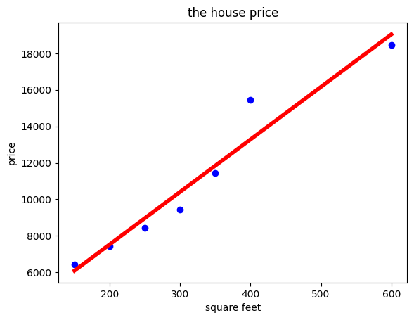
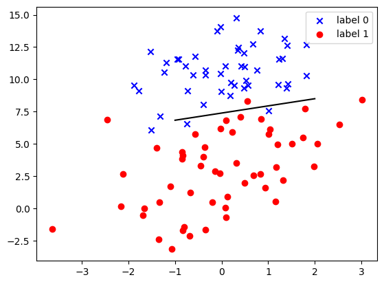

# 实验三 实验报告

> 本实验源码见 [code](./code/) 文件夹。

智能 212 史胤隆  
2006010529

## 实验目的

学习并掌握线性回归与逻辑回归的原理；
熟悉并能够运用scikit-learn工具包的模型。

## 实验内容

完成实验既定题目; 具体题目见实验结果.

## 实验结果

### 根据house_price.csv文件中提供的房屋面积和房价的数据，拟合出它们的线性回归方程打印输出，并画出数据的散点图和拟合出的回归线。

```python
import matplotlib.pyplot as plt
import pandas as pd
from sklearn.linear_model import LinearRegression

data = pd.read_csv('./house_price.csv')
X = []
Y = []
for single_square_feet, single_price_value in zip(data['square_feet'], data['price']):
    X.append([float(single_square_feet)])
    Y.append([float(single_price_value)])

linear = LinearRegression()
linear.fit(X, Y)

plt.scatter(X, Y, color='blue')
plt.plot(X, linear.predict(X), color='red', linewidth=4)
plt.title('the house price')
plt.xlabel('square feet')
plt.ylabel('price')
plt.show()

print('回归方程为：y = ', round(linear.coef_[
      0][0], 2), 'x + ', round(linear.intercept_[0], 2))

```



​    


    回归方程为：y =  28.78 x +  1771.81


### 根据LR-dataset.csv文件中的数据，拟合逻辑回归方程并打印输出，画出数据的散点图和逻辑回归线。

```python
import matplotlib.pyplot as plt
import numpy as np
from sklearn import linear_model

data = np.genfromtxt("LR-dataset.csv", delimiter=",")
x = data[:, :-1]
y = data[:, -1]

x0 = []
x1 = []
y0 = []
y1 = []
for i in range(len(x)):
    if y[i] == 0:
        x0.append(x[i, 0])
        y0.append(x[i, 1])
    else:
        x1.append(x[i, 0])
        y1.append(x[i, 1])

logistic = linear_model.LogisticRegression()
logistic.fit(x, y)

scatter0 = plt.scatter(x0, y0, c='b', marker='x')
scatter1 = plt.scatter(x1, y1, c='r', marker='o')
plt.legend(handles=[scatter0, scatter1], labels=[
           'label 0', 'label 1'], loc='best')

x_test = np.array([[-1], [2]])
y_test = (-logistic.intercept_ - x_test *
          logistic.coef_[0][0])/logistic.coef_[0][1]

plt.plot(x_test, y_test, 'k')
plt.show()

print('逻辑回归方程是：y = - (', round((-logistic.intercept_[0]/logistic.coef_[
      0][1]), 2), round((logistic.coef_[0][0]/logistic.coef_[0][1]), 2), 'x)')

```


    


    逻辑回归方程是：y = - ( 7.38 -0.56 x)

