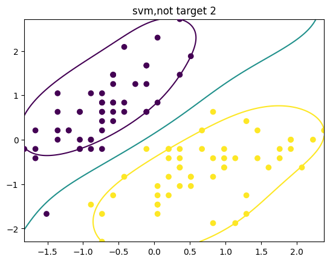

# 实验四 实验报告

> 本实验源码见 [code](./code/) 文件夹。

智能 212 史胤隆  
2006010529

## 实验目的

学习并掌握信息熵的计算过程；
掌握决策树的ID3算法原理以及优缺点；
熟悉并运用scikit-learn工具包的模型。

## 实验内容

完成实验既定题目; 具体题目见实验结果.

## 实验结果

### 对于不同的人是否会购买电脑，请根据文件中提供的数据，假设决策树是一个二叉树，用ID3算法生成一个决策树，输出决策树的结构。

```python
import graphviz
from sklearn.feature_extraction import DictVectorizer
from sklearn import tree
from sklearn import preprocessing
import csv

Dtree = open(r'DecisionTreeSet.csv', 'r')
reader = csv.reader(Dtree)

headers = reader.__next__()

feature = []
label = []

for row in reader:
    label.append(row[-1])
    rowDict = {}
    for i in range(1, len(row) - 1):
        rowDict[headers[i]] = row[i]
    feature.append(rowDict)

vec = DictVectorizer()
x = vec.fit_transform(feature).toarray()
print('转换成数字表示的x: ' + str(x))

print('属性名称为：', vec.get_feature_names())

lb = preprocessing.LabelBinarizer()
y = lb.fit_transform(label)
print("标签y:", label)
print("转换后的标签y:" + str(y))

model = tree.DecisionTreeClassifier(criterion='entropy')
model.fit(x, y)

dot_data = tree.export_graphviz(model,
                                out_file=None,
                                feature_names=vec.get_feature_names(),
                                class_names=lb.classes_,
                                filled=True,
                                rounded=True,
                                special_characters=True)
graph = graphviz.Source(dot_data)
graph.render('BuyComputer')

```

    转换成数字表示的x: [[0. 0. 1. 0. 1. 1. 0. 0. 1. 0.]
     [0. 0. 1. 1. 0. 1. 0. 0. 1. 0.]
     [1. 0. 0. 0. 1. 1. 0. 0. 1. 0.]
     [0. 1. 0. 0. 1. 0. 0. 1. 1. 0.]
     [0. 1. 0. 0. 1. 0. 1. 0. 0. 1.]
     [0. 1. 0. 1. 0. 0. 1. 0. 0. 1.]
     [1. 0. 0. 1. 0. 0. 1. 0. 0. 1.]
     [0. 0. 1. 0. 1. 0. 0. 1. 1. 0.]
     [0. 0. 1. 0. 1. 0. 1. 0. 0. 1.]
     [0. 1. 0. 0. 1. 0. 0. 1. 0. 1.]
     [0. 0. 1. 1. 0. 0. 0. 1. 0. 1.]
     [1. 0. 0. 1. 0. 0. 0. 1. 1. 0.]
     [1. 0. 0. 0. 1. 1. 0. 0. 0. 1.]
     [0. 1. 0. 1. 0. 0. 0. 1. 1. 0.]]
    属性名称为： ['age=middle_aged', 'age=senior', 'age=youth', 'credit_rating=excellent', 'credit_rating=fair', 'income=high', 'income=low', 'income=medium', 'student=no', 'student=yes']
    标签y: ['no', 'no', 'yes', 'yes', 'yes', 'no', 'yes', 'no', 'yes', 'yes', 'yes', 'yes', 'yes', 'no']
    转换后的标签y:[[0]
     [0]
     [1]
     [1]
     [1]
     [0]
     [1]
     [0]
     [1]
     [1]
     [1]
     [1]
     [1]
     [0]]


    c:\Users\syl20\AppData\Local\Programs\Python\Python310\lib\site-packages\sklearn\utils\deprecation.py:87: FutureWarning: Function get_feature_names is deprecated; get_feature_names is deprecated in 1.0 and will be removed in 1.2. Please use get_feature_names_out instead.
      warnings.warn(msg, category=FutureWarning)
    c:\Users\syl20\AppData\Local\Programs\Python\Python310\lib\site-packages\sklearn\utils\deprecation.py:87: FutureWarning: Function get_feature_names is deprecated; get_feature_names is deprecated in 1.0 and will be removed in 1.2. Please use get_feature_names_out instead.
      warnings.warn(msg, category=FutureWarning)

    'BuyComputer.pdf'


### iris数据集是常用的分类数据集，请用SVM对该数据集进行两两分类，比较不同的核函数对分类结果准确率的影响，并做出数据的散点图和超平面。

```python
import numpy as np
from matplotlib import pyplot as plt
from sklearn.svm import SVC
from sklearn.datasets import load_iris
from sklearn.model_selection import train_test_split

data = load_iris()

X = data['data']
y = data['target']

A = 2
X = X[y != A, 0:2]
y = y[y != A]

X -= np.mean(X, axis=0)
X /= np.std(X, axis=0, ddof=1)
m = len(X)

X_train, X_test, y_train, y_test = train_test_split(
    X, y, train_size=0.7, random_state=0)

model_svm = SVC(C=1, kernel='rbf')

model_svm.fit(X_train, y_train)

acc = model_svm.score(X_test, y_test)
print('测试集的准确率为：', acc)

x1_min, x1_max, x2_min, x2_max = np.min(X[:, 0]), np.max(
    X[:, 0]), np.min(X[:, 1]), np.max(X[:, 1])
x1, x2 = np.mgrid[x1_min:x1_max:200j, x2_min:x2_max:200j]
x1x2 = np.c_[x1.ravel(), x2.ravel()]
z = model_svm.decision_function(x1x2)
z = z.reshape(x1.shape)

plt.scatter(X[:, 0], X[:, 1], c=y, zorder=10)

plt.contour(x1, x2, z, levels=[-1, 0, 1])
plt.title('svm,not target %d' % A)
plt.show()

```

    测试集的准确率为： 1.0


    

