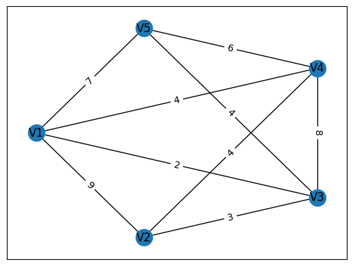
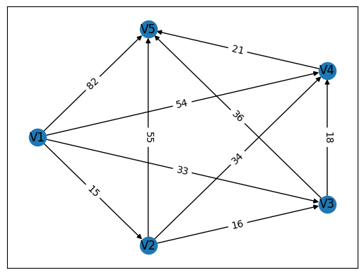

# 实验五 实验报告

> 本实验源码见 [code](./code/) 文件夹。

智能 212 史胤隆  
2006010529

## 实验目的

学习并掌握图表示与规划的相关内容；
熟悉并能够运用networkx工具包的模型。

## 实验内容

完成实验既定题目; 具体题目见实验结果.

## 实验结果

### 写出加权无向图对应的邻接矩阵。

```text
[[0, 9, 2, 4, 7],
 [9, 0, 3, 4, ∞],
 [2, 3, 0, 8, 4],
 [4, 4, 8, 0, 6],
 [7, ∞, 4, 6, 0]]
```

### 利用python提供的networkx工具包，在python中画出该图。

```python
import networkx as nx
import pylab as plt
import numpy as np

inf = float('inf')
nodes = np.array([[0, 9, 2, 4, 7],
                  [9, 0, 3, 4, inf],
                  [2, 3, 0, 8, 4],
                  [4, 4, 8, 0, 6],
                  [7, inf, 4, 6, 0]])
G = nx.Graph()
G.add_nodes_from(['V1', 'V2', 'V3', 'V4', 'V5'])
for i in range(5):
    for j in range(5):
        if nodes[i, j] != inf and i != j:
            G.add_edge('V'+str(i+1), 'V'+str(j+1), weight=int(nodes[i, j]))
pos = nx.shell_layout(G)
edge_labels = nx.get_edge_attributes(G, 'weight')
nx.draw_networkx(G, pos)
nx.draw_networkx_edge_labels(G, pos, edge_labels=edge_labels)
plt.show()

```

 
​    

### 求图G中从v3到v7的最短路及最短距离。直接调用networkx库函数，编写Python程序。

```python
import networkx as nx

List = [(0, 1, 1), (0, 2, 2), (0, 4, 7), (0, 6, 4), (0, 7, 8), (1, 2, 2), (1, 3, 3), (1, 7, 7),
        (2, 3, 1), (2, 4, 5), (3, 4, 3), (3, 5, 6), (4, 5, 4), (4, 6, 3), (5, 6, 6), (5, 7, 4), (6, 7, 2)]
G = nx.Graph()
G.add_weighted_edges_from(List)
print('最短路径', nx.shortest_path(G, source=3, target=7, weight='weight'))
print('最短距离', nx.shortest_path_length(G, source=3, target=7, weight='weight'))

```

    最短路径 [3, 4, 6, 7]
    最短距离 8

### 工程设备换代问题

```python
import networkx as nx
import pylab as plt
import numpy as np

purchase = [25, 26, 28, 31]
maintain = [10, 14, 18, 26]
surplus = [20, 16, 13, 11]


def wij(i, j):
    return purchase[i] + sum(maintain[0:j-i]) - surplus[j-i-1]


data = np.zeros((5, 5), dtype=int)
for i in range(4):
    for j in range(i+1, 5):
        data[i, j] = wij(i, j)
D = nx.DiGraph()
D.add_nodes_from(['V1', 'V2', 'V3', 'V4', 'V5'])
for i in range(5):
    for j in range(5):
        if data[i, j] != 0:
            D.add_edge('V'+str(i+1), 'V'+str(j+1), weight=int(data[i, j]))

print('最短路径', nx.shortest_path(D, source='V1', target='V5', weight='weight'))
print('最短距离', nx.shortest_path_length(
    D, source='V1', target='V5', weight='weight'))

pos = nx.shell_layout(D)
edge_labels = nx.get_edge_attributes(D, 'weight')
nx.draw_networkx(D, pos)
nx.draw_networkx_edge_labels(D, pos, edge_labels=edge_labels)
plt.show()

```

    最短路径 ['V1', 'V2', 'V3', 'V5']
    最短距离 67


    
